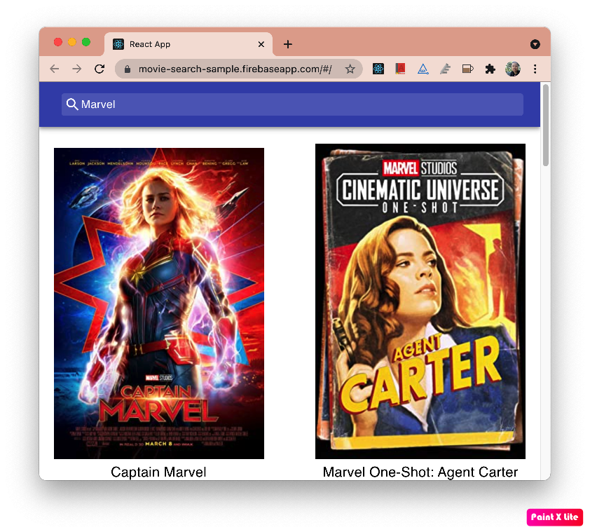
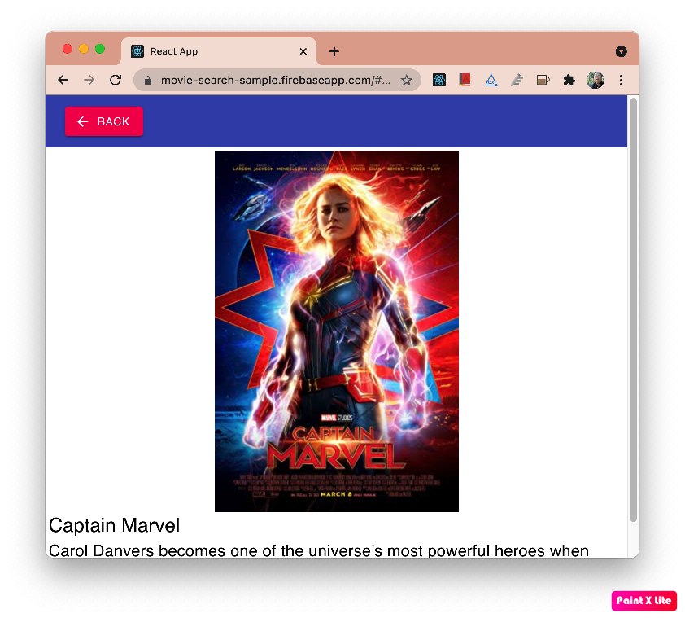

# Project Introduction

Movie Seach is a small project for searching movies from Open Movie Database (OMDb) REST API.

# Tech Stacks

**React Hooks**: for the components.

**React Context**: for data management.

**Material UI**: for UI/UX and responsive.

**Unit Test**: recommended `@testing-library` by react-create app.

# Setup Project Locally

Please replace the OMDB API Key (`<Your Key>`) in the `config/index.js` file by your own.

## Install

After checkout the project from github then run

```sh
yarn install
```

## Start App

```sh
yarn start
```

Runs the app in the development mode.\
Open [http://localhost:3000](http://localhost:3000) to view it in the browser.

The page will reload if you make edits.\
You will also see any lint errors in the console.

## Test App

```sh
npm test
```

Launches the test runner in the interactive watch mode.\
See the section about [running tests](https://facebook.github.io/create-react-app/docs/running-tests) for more information.

If you want to see the code coverage, run

```sh
yarn test --coverage
```

## Build App

```sh
yarn build
```

Builds the app for production to the `build` folder.\
It correctly bundles React in production mode and optimizes the build for the best performance.

The build is minified and the filenames include the hashes.\
Your app is ready to be deployed!

See the section about [deployment](https://facebook.github.io/create-react-app/docs/deployment) for more information.

# Source Code

```sh
git clone https://github.com/lapth/movie-search.git
```

# DEMO

## Live Demo

[Movie Search Live Demo](https://movie-search-sample.firebaseapp.com) `https://movie-search-sample.firebaseapp.com`

## Some Screen Captures

**Movie Search Home Page**


**Movie Detail Page**

